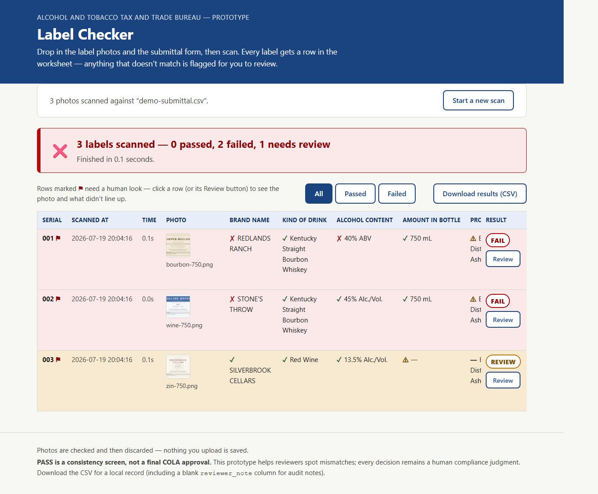
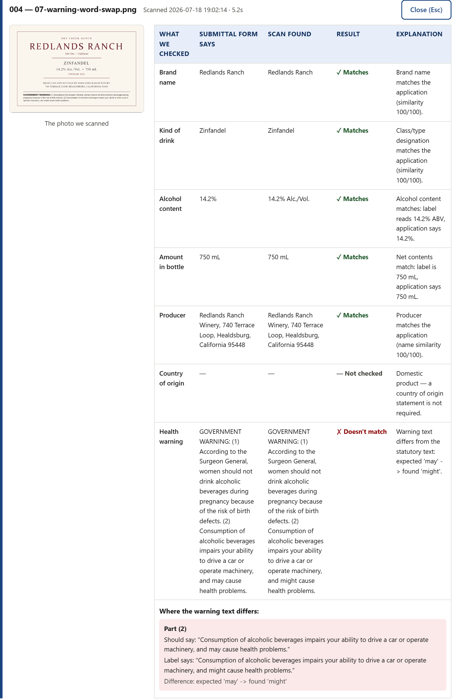
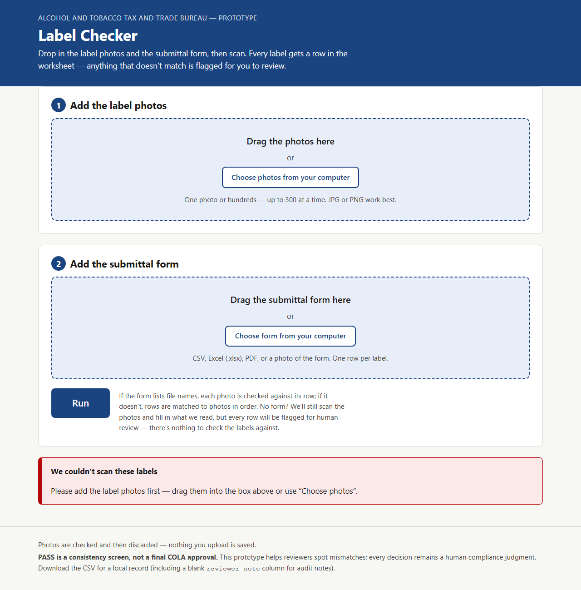
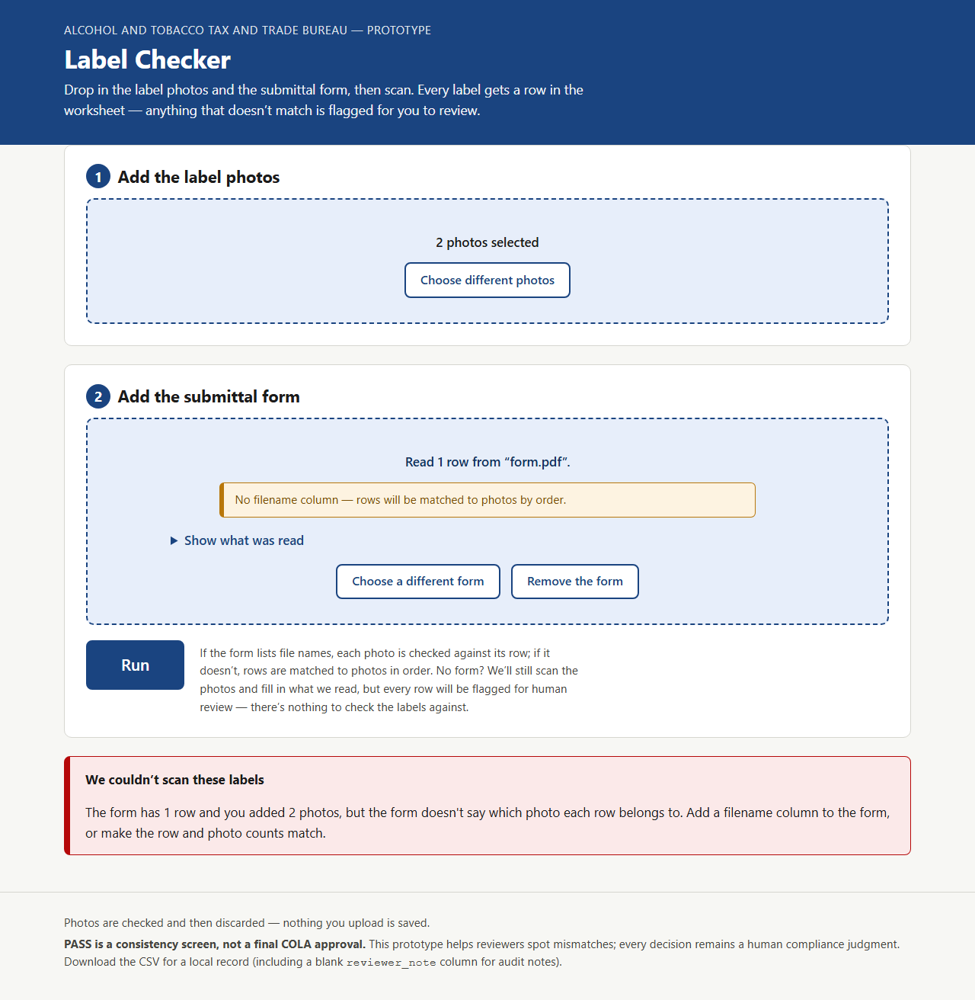
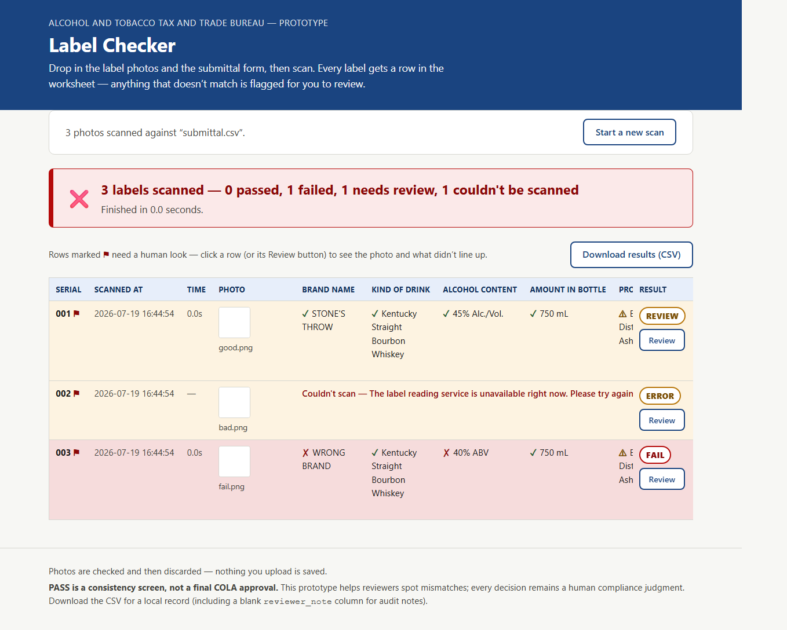
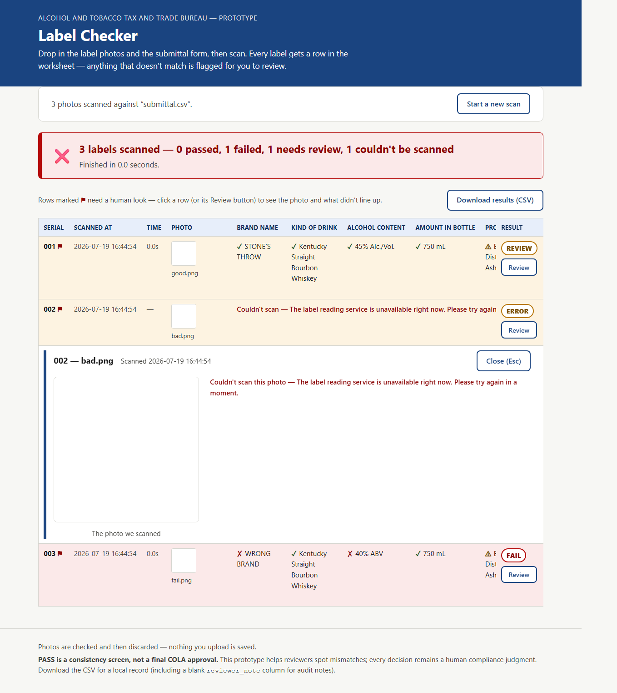
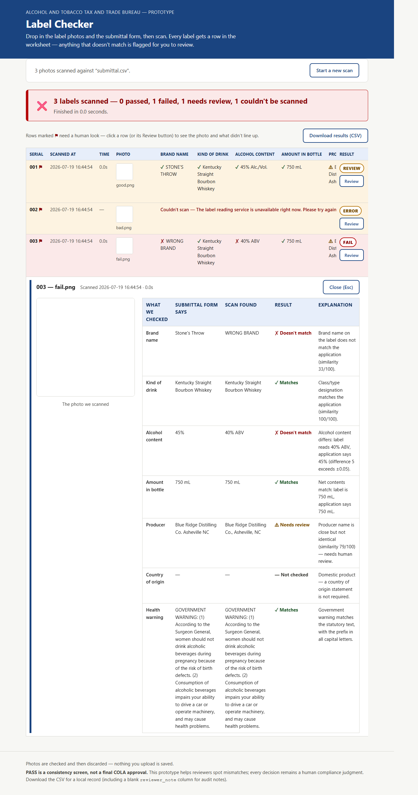
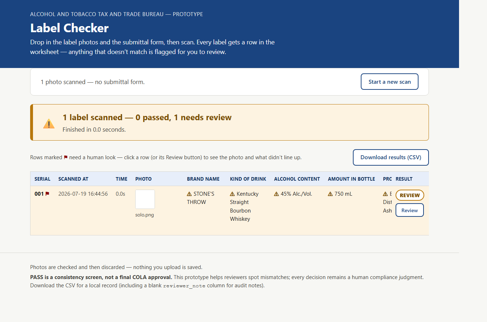
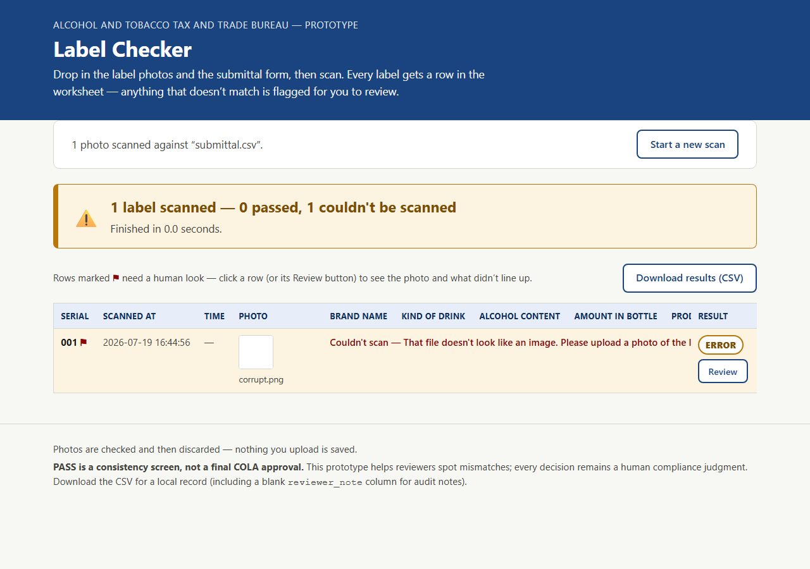

# TTB Label Verify

A proof-of-concept web tool for TTB label compliance review. An agent drops in
label photos (one or hundreds) plus the submittal form in whatever format the
applicant sent (CSV, Excel, PDF, or a photo); one Claude vision call per label
transcribes it, and a deterministic rules engine compares the seven required
fields (brand, class/type, alcohol content, net contents, producer, country of
origin, government health warning). Every label becomes a row in a worksheet —
serial number, timestamp, per-field verdict marks, a score, and a
PASS / FAIL / REVIEW result — in a few seconds per label. Design rationale and
requirements traceability are in [APPROACH.md](APPROACH.md).

**Live demo:** <https://ttb-label-verify-cqzj.onrender.com> — bring a label
photo and a one-row submittal form (or a CSV like the example below) and press
Run.

## Screenshots

The worksheet after a mixed scan — serials, timestamps, per-label time, the
seven field columns with verdict marks, scores, and PASS / FAIL / REVIEW
badges; flagged rows are tinted:



The review drill-down on a failed row — the label photo, the submitted-vs-found
comparison for every field, and the per-clause diff of the health warning:



### Error and problem states

Friendly, plain-language error UI (pre-scan blocks, per-row ERROR/FAIL/REVIEW).
Full set and capture script: [docs/screenshots/error-ui/](docs/screenshots/error-ui/).

Pre-scan validation — Run with no photos:



Scan blocked when form rows and photos cannot be paired safely:



Worksheet after a mixed scan — PASS / ERROR (extraction failed) / FAIL:



Drill-down on an ERROR row (friendly message, no field table):



Drill-down on a FAIL row (submitted vs found comparison):



Photos only, no submittal form — every row flagged REVIEW (never a silent pass):



Bad / non-image file — per-row ERROR and summary banner:



## Quick start

Requires Python 3.11+.

```bash
python -m venv .venv
source .venv/bin/activate        # Windows: .venv\Scripts\activate
pip install -r requirements.txt
cp .env.example .env             # then set ANTHROPIC_API_KEY in .env
uvicorn app.main:app --port 8000
```

Open http://localhost:8000.

### Docker

```bash
docker build -t ttb-label-verify .
docker run --rm -p 8000:8000 -e ANTHROPIC_API_KEY=your-key ttb-label-verify
```

## How to use

There is one flow, whether you have one label or three hundred:

1. **Add the label photos.** Drag them into the drop zone or use the file
   picker — 1 to 300 photos per scan.
2. **Add the submittal form** — in whatever format the applicant sent: a CSV
   or TSV, an Excel sheet (`.xlsx`), a PDF, or a photo of the form. One row
   per label. Spreadsheet formats are parsed deterministically
   (case-insensitive column aliases like "Class Type" or "Alcohol Content"
   are fine); PDFs and photos are transcribed by the document reader. The
   parsed rows appear under "Show what was read" so you can eyeball the parse
   before scanning.
3. **Press "Run".** Progress ticks as each sub-batch finishes and rows appear
   in the worksheet as they land.

Rows that name a photo file are matched by file name. If the form has no
file names, rows are matched to photos **in order** (a persistent notice
reminds you to check the pairings); if the row and photo counts differ, the
scan is blocked with an explanation rather than guessing.

Each worksheet row shows a serial number, the scan timestamp, the per-label
processing time, a thumbnail, the seven extracted field values each with a
✓ / ⚠ / ✗ / — mark, a score ("6/6 fields match"), and a PASS / FAIL / REVIEW
result. Flagged rows (FAIL and REVIEW) open a drill-down — click the row or
its Review button — showing the label photo large, the submitted-vs-found
comparison per field with a one-sentence explanation, and a per-clause diff
when the health warning text differs. Download the whole worksheet as CSV
when done.

**No submittal form?** The photos are still scanned and the extracted columns
filled in, but every row is flagged "No submittal data — needs review" —
there is nothing to check the labels against. The statutory health-warning
check still runs, so a wrong warning still fails.

**Required-elements check.** Independent of the submittal comparison, each row
is checked for the elements TTB requires on every label of its class family
(brand, class/type, net contents, producer, health warning — plus alcohol
content for wine and distilled spirits). An element not found in the photo
flags the row for review — not failure, since net contents or the producer
statement may be embossed on the container and the warning may sit on another
label of the set. Details and citations are in [APPROACH.md](APPROACH.md).

Whatever format the submittal form arrives in — CSV, TSV, Excel (`.xlsx`), a
PDF, or a photo — it is read and normalized into one canonical column set:
spreadsheets are parsed directly (case-insensitive header aliases), PDFs and
photos are transcribed by the document reader. Those columns (`brand` required,
the rest optional — `filename` recommended so rows match photos by name), shown
here as the CSV a spreadsheet export produces:

```csv
filename,brand,class_type,abv,net_contents,producer,origin_country,is_import
bourbon-750.jpg,Copper Hollow,Kentucky Straight Bourbon Whiskey,45%,750 mL,"Copper Hollow Distilling Co., Bardstown, KY",,false
gin-import.jpg,Juniper Gate,London Dry Gin,47%,700 mL,"Juniper Gate Distillery, London",England,true
wine-750.jpg,Silverbrook Cellars,Red Wine,13.5%,750 mL,,,false
```

## Running tests

```bash
pip install -r requirements.txt
playwright install chromium      # once, for the browser E2E tests
pytest
```

The offline suite (442 tests, about 40 seconds) covers the rules engine, the
form-ingestion parsers, the API with mocked extractors, real-browser E2E of
the worksheet flow against a fake backend, and five adversarial QA gates. It
never touches the network and needs no API key.

Two paths need a real `ANTHROPIC_API_KEY`:

```bash
pytest -m live               # one live smoke call through the real pipeline
python eval/run_eval.py      # full 16-label eval against ground truth
```

## Configuration

| Variable | Default | Purpose |
|----------|---------|---------|
| `ANTHROPIC_API_KEY` | (none) | Server-side only; required for real label extraction. Never sent to the browser. |
| `BATCH_CONCURRENCY` | `4` | How many labels are processed in parallel during a batch. |
| `EXTRACTION_MODEL` | `claude-sonnet-5` | Model used for label extraction and PDF/photo form reading. `claude-haiku-4-5-20251001` measured faster on the eval set, with trade-offs documented in [APPROACH.md](APPROACH.md). |
| `VERIFY_API_KEY` | (none) | Optional. When set, `/api/verify*` and `/api/ingest-form` require `X-API-Key` (or Bearer). Health + UI stay open. |
| `RATE_LIMIT_PER_MINUTE` | `0` (off) | Optional per-IP cap on protected API routes. |
| `MAX_IMAGE_BYTES` | `40MB` | Per-photo upload cap (friendly 413 when exceeded). |
| `MAX_FORM_BYTES` | `20MB` | Submittal-form / manifest upload cap. |
| `MAX_BATCH_TOTAL_BYTES` | `200MB` | Total bytes across one batch request. |

## Deployment

The live demo runs on [Render](https://render.com) from
[`render.yaml`](render.yaml) — a blueprint that builds the [Dockerfile](Dockerfile)
as a warm Starter web service (no cold-start on the first request) with a
`/api/health` check. To deploy your own:

1. **New → Blueprint** in the Render dashboard and connect this repo. Render
   reads `render.yaml` and provisions one service, `ttb-label-verify`.
2. When prompted, paste your key into **`ANTHROPIC_API_KEY`** (marked
   `sync: false`, so it stays a dashboard secret, never in the repo).
3. **Apply.** First Docker build takes ~2-3 min; every push to `main`
   redeploys automatically.

The container binds `$PORT` (with a `8000` fallback), so the same image runs
unchanged on Render, Cloud Run, or a plain `docker run`. Nothing is persisted
server-side, so the service is stateless and horizontally scalable as-is.

## Repo layout

| Path | Contents |
|------|----------|
| `app/` | FastAPI app, extraction seam, rules engine, static UI |
| `eval/` | Synthetic 16-label test set, generator, manifest, eval harness |
| `tests/` | Offline test suite; `tests/qa/` is the independent adversarial QA suite |
| `docs/` | Build spec, test plan, QA report, screenshots |
