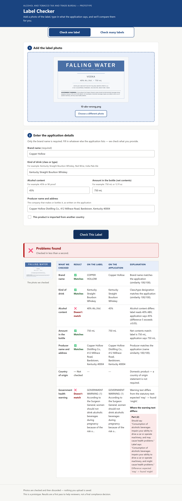
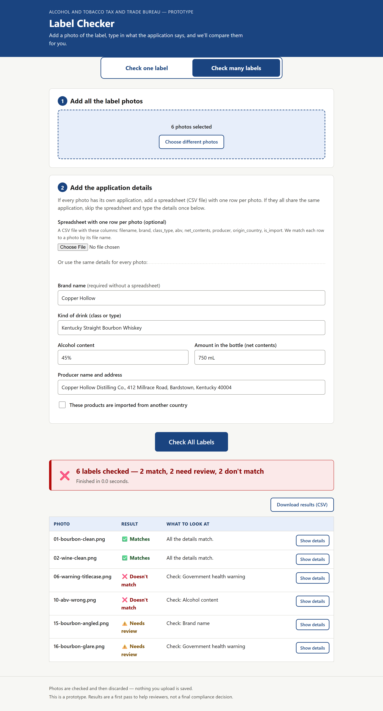

# TTB Label Verify

A proof-of-concept web tool for TTB label compliance review. An agent uploads a
photo of an alcohol beverage label plus the application data; one Claude vision
call transcribes the label, and a deterministic rules engine compares the seven
required fields (brand, class/type, alcohol content, net contents, producer,
country of origin, government health warning) and returns a per-field verdict
in a few seconds. Design rationale and requirements traceability are in
[APPROACH.md](APPROACH.md).

## Screenshots

Single label with mismatches found (wrong ABV, warning text differs, with a
per-clause diff):



Batch check with per-label results and CSV export:



## Quick start

Requires Python 3.11+.

```bash
python -m venv .venv
source .venv/bin/activate        # Windows: .venv\Scripts\activate
pip install -r requirements.txt
cp .env.example .env             # then set ANTHROPIC_API_KEY in .env
uvicorn app.main:app --port 8000
```

Open http://localhost:8000.

### Docker

```bash
docker build -t ttb-label-verify .
docker run --rm -p 8000:8000 -e ANTHROPIC_API_KEY=your-key ttb-label-verify
```

## How to use

**Check one label:** add the photo (drag-and-drop or file picker), type in what
the application says (only the brand name is required), click "Check This
Label". Each field renders as ✅ Matches / ⚠️ Needs review / ❌ Doesn't match
with the label value, the application value, and a one-sentence explanation.
The elapsed time is shown on every result.

**Check many labels:** switch to the "Check many labels" tab and add up to 300
photos. Application data comes from either:

- a CSV spreadsheet with one row per photo, matched by file name, or
- one shared set of form fields applied to every photo (useful for
  spot-checking a production run of the same product).

Results stream in as each sub-batch finishes; download the full table as CSV
when done.

CSV manifest format (`filename` and `brand` required, the rest optional):

```csv
filename,brand,class_type,abv,net_contents,producer,origin_country,is_import
bourbon-750.jpg,Copper Hollow,Kentucky Straight Bourbon Whiskey,45%,750 mL,"Copper Hollow Distilling Co., Bardstown, KY",,false
gin-import.jpg,Juniper Gate,London Dry Gin,47%,700 mL,"Juniper Gate Distillery, London",England,true
wine-750.jpg,Silverbrook Cellars,Red Wine,13.5%,750 mL,,,false
```

## Running tests

```bash
pip install -r requirements.txt
playwright install chromium      # once, for the browser E2E tests
pytest
```

The offline suite (296 tests, about 20 seconds) covers the rules engine, the
API with a mocked extractor, real-browser E2E against a fake backend, and three
adversarial QA suites. It never touches the network and needs no API key.

Two paths need a real `ANTHROPIC_API_KEY`:

```bash
pytest -m live               # one live smoke call through the real pipeline
python eval/run_eval.py      # full 16-label eval against ground truth
```

## Configuration

| Variable | Default | Purpose |
|----------|---------|---------|
| `ANTHROPIC_API_KEY` | (none) | Server-side only; required for real label extraction. Never sent to the browser. |
| `BATCH_CONCURRENCY` | `4` | How many labels are processed in parallel during a batch. |

## Repo layout

| Path | Contents |
|------|----------|
| `app/` | FastAPI app, extraction seam, rules engine, static UI |
| `eval/` | Synthetic 16-label test set, generator, manifest, eval harness |
| `tests/` | Offline test suite; `tests/qa/` is the independent adversarial QA suite |
| `docs/` | Build spec, test plan, screenshots |
